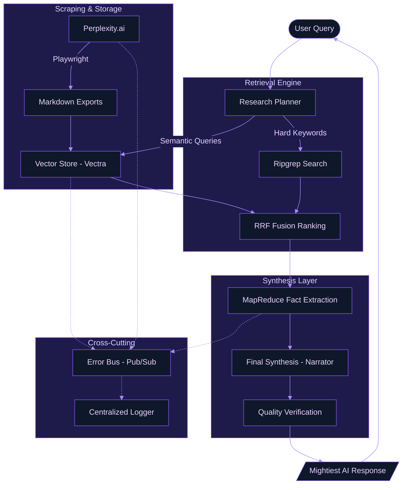

# System Architecture & Cognitive Foundations

This document elucidates the architectural blueprints and theoretical underpinnings of the Perplexity History Export tool. It is designed for those who seek to understand the mechanics of our "Mightiest RAG" implementation and the resilience of our distributed extraction engine.

---

<!-- toc -->

- [1. High-Level Flow Diagram](#1-high-level-flow-diagram)
- [2. RAG Cognitive Structure](#2-rag-cognitive-structure)
  * [Stage A: Adaptive Planning](#stage-a-adaptive-planning)
  * [Stage B: Hybrid Retrieval & Fusion](#stage-b-hybrid-retrieval--fusion)
  * [Stage C: Granular MapReduce Fact Extraction](#stage-c-granular-mapreduce-fact-extraction)
- [3. Error Bus & Diagnostic Resilience](#3-error-bus--diagnostic-resilience)
- [4. Theoretical Foundations](#4-theoretical-foundations)
  * [Hybrid Search & RRF](#hybrid-search--rrf)
  * [Retrieval-Augmented Generation (RAG)](#retrieval-augmented-generation-rag)
  * [MapReduce for Context Compression](#mapreduce-for-context-compression)
- [5. Visualizing the Retrieval Loop](#5-visualizing-the-retrieval-loop)

<!-- tocstop -->

---

## 1. High-Level Flow Diagram

The following diagram illustrates the lifecycle of data, from the initial extraction from Perplexity.ai to the interactive synthesis in the REPL.

---

## 2. RAG Cognitive Structure

Our RAG implementation is not a simple "retrieve and stuff" pipeline. It follows a multi-stage cognitive process inspired by modern IR (Information Retrieval) and LLM orchestration patterns.

### Stage A: Adaptive Planning

Before any retrieval, the system acts as a **Research Planner**. It decomposes the user's query into:

- **Strategy**: Selecting between `precise` (targeted facts) or `exhaustive` (broad historical overview).
- **Semantic Variations**: Generating multiple search phrases to cover different linguistic facets of the query.
- **Hard Keywords**: Identifying unique entities or technical IDs that require exact-match precision.

### Stage B: Hybrid Retrieval & Fusion

We employ a **Hybrid Search** strategy, combining the strengths of dense and sparse retrieval:

- **Dense (Vector)**: Captures semantic intent and conceptual similarity using embeddings (`nomic-embed-text`).
- **Sparse (Exact)**: Leverages `ripgrep` for high-velocity exact string matching, ensuring technical IDs or specific names are never missed.

Results are then merged using **Reciprocal Rank Fusion (RRF)**, which provides a robust ranking by combining the ordinal positions of items from different search pools without needing normalized scores.

### Stage C: Granular MapReduce Fact Extraction

To mitigate "lost in the middle" phenomena and context window saturation, we utilize a **MapReduce** approach:

1. **Map**: Each snippet is analyzed in small, high-density batches to extract atomic facts, code snippets, and dates.
2. **Reduce**: These verified facts are then synthesized into a final, authoritative response with full source provenance.

---

## 3. Error Bus & Diagnostic Resilience

Central to our architectural integrity is the **Error Bus** (`src/utils/error-bus.ts`). Inspired by the Martin Fowler Event Bus pattern, this component serves as a decoupled junction for system health.

- **Pub/Sub Decoupling**: Operational logic (Scrapers, RAG) is entirely decoupled from diagnostic logic (Logger).
- **Error Raising**: Custom exceptions are emitted to the bus before being thrown, ensuring that even if a worker crashes, its last state is preserved.
- **Error Reporting**: Non-fatal inconsistencies are "reported" to the bus, allowing the logger to render high-fidelity context without interrupting the execution flow.

For more details, see [ERROR_HANDLING.md](./ERROR_HANDLING.md).

---

## 4. Theoretical Foundations

### Hybrid Search & RRF

Hybrid Search addresses the limitations of pure vector-based systems, which can often hallucinate relationships between unrelated entities with similar embedding vectors. By incorporating `ripgrep`, we anchor our retrieval in literal truth.

**Reference**: *Cormack, G. V., Clarke, C. L., & Buettcher, S. (2009). Reciprocal rank fusion outperforms Condorcet and individual rank learning methods.*

### Retrieval-Augmented Generation (RAG)

Our system facilitates a "conversational memory" by grounding LLM generation in private data. This minimizes hallucinations and allows for local-first intelligence.

### MapReduce for Context Compression

By "mapping" facts from individual segments before "reducing" them into a final answer, we ensure that the LLM is always working with high-entropy, high-relevance information.

---

## 5. Visualizing the Retrieval Loop

The system iteratively refines its search based on the research plan, ensuring that the "Mightiest Response" is built on a foundation of exhaustive evidence.
