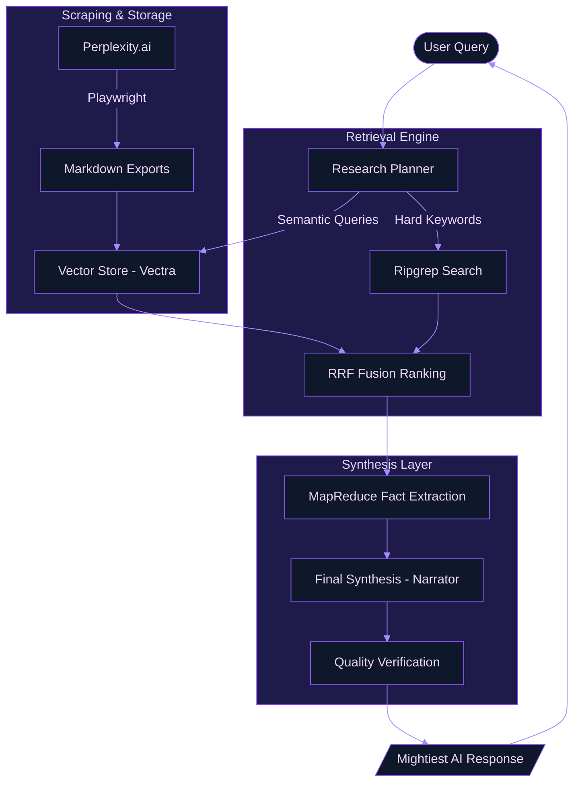
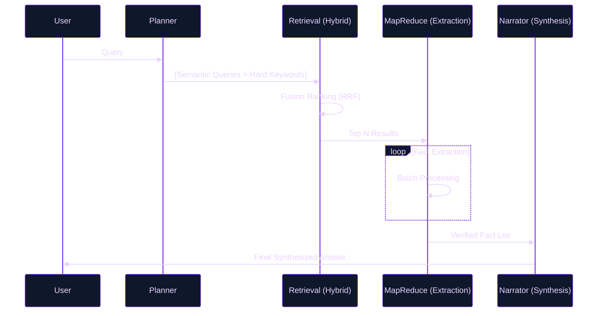

# System Architecture & Cognitive Foundations

This document elucidates the architectural blueprints and theoretical underpinnings of the Perplexity History Export tool. It is designed for those who seek to understand the mechanics of our "Mightiest RAG" implementation.

---

<!-- toc -->

- [1. High-Level Flow Diagram](#1-high-level-flow-diagram)
- [2. RAG Cognitive Structure](#2-rag-cognitive-structure)
  * [Stage A: Adaptive Planning](#stage-a-adaptive-planning)
  * [Stage B: Hybrid Retrieval & Fusion](#stage-b-hybrid-retrieval--fusion)
  * [Stage C: Granular MapReduce Fact Extraction](#stage-c-granular-mapreduce-fact-extraction)
- [3. Theoretical Foundations](#3-theoretical-foundations)
  * [Hybrid Search & RRF](#hybrid-search--rrf)
  * [Retrieval-Augmented Generation (RAG)](#retrieval-augmented-generation-rag)
  * [MapReduce for Context Compression](#mapreduce-for-context-compression)
- [4. Visualizing the Retrieval Loop](#4-visualizing-the-retrieval-loop)

<!-- tocstop -->

---

## 1. High-Level Flow Diagram

The following diagram illustrates the lifecycle of data, from the initial extraction from Perplexity.ai to the interactive synthesis in the REPL.

---

## 2. RAG Cognitive Structure

Our RAG implementation is not a simple "retrieve and stuff" pipeline. It follows a multi-stage cognitive process inspired by modern IR (Information Retrieval) and LLM orchestration patterns.

### Stage A: Adaptive Planning
Before any retrieval, the system acts as a **Research Planner**. It decomposes the user's query into:
- **Strategy**: Selecting between \`precise\` (targeted facts) or \`exhaustive\` (broad historical overview).
- **Semantic Variations**: Generating multiple search phrases to cover different linguistic facets of the query.
- **Hard Keywords**: Identifying unique entities or technical IDs that require exact-match precision.

### Stage B: Hybrid Retrieval & Fusion
We employ a **Hybrid Search** strategy, combining the strengths of dense and sparse retrieval:
- **Dense (Vector)**: Captures semantic intent and conceptual similarity using embeddings (\`nomic-embed-text\`).
- **Sparse (Exact)**: Leverages \`ripgrep\` for high-velocity exact string matching, ensuring technical IDs or specific names are never missed.

Results are then merged using **Reciprocal Rank Fusion (RRF)**, which provides a robust ranking by combining the ordinal positions of items from different search pools without needing normalized scores.

### Stage C: Granular MapReduce Fact Extraction
To mitigate "lost in the middle" phenomena and context window saturation, we utilize a **MapReduce** approach:
1. **Map**: Each snippet is analyzed in small, high-density batches to extract atomic facts, code snippets, and dates.
2. **Reduce**: These verified facts are then synthesized into a final, authoritative response with full source provenance.

---

## 3. Theoretical Foundations

Our architecture is informed by several key papers and concepts in the field of AI and Information Retrieval:

### Hybrid Search & RRF
- **Reciprocal Rank Fusion (RRF)**: Based on the principle that combining multiple search orderings can significantly outperform any single ordering.
  - *Reference:* [Cormack et al., 2009. Reciprocal Rank Fusion outperforms Condorcet and Individual Rank Classifiers.](https://arxiv.org/abs/1407.5645)

### Retrieval-Augmented Generation (RAG)
- **General RAG Framework**: We follow the core paradigm of grounding LLM outputs in external, verifiable data.
  - *Reference:* [Lewis et al., 2020. Retrieval-Augmented Generation for Knowledge-Intensive NLP Tasks.](https://arxiv.org/abs/2005.11401)

### MapReduce for Context Compression
- **Summarization & Synthesis**: Our fact extraction layer mirrors the "MapReduce" chain pattern, effectively handling long-context retrieval by distilling information before final generation.
  - *Reference:* [Wu et al., 2021. Recursively Summarizing Books with Human Feedback.](https://arxiv.org/abs/2109.10862) (Applying hierarchical summarization principles).

---

## 4. Visualizing the Retrieval Loop

