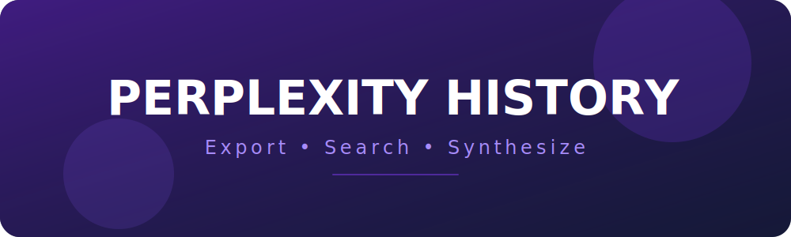

<p align="center">
  
</p>

<p align="center">
  
  
  
  
  
</p>

---

<!-- toc -->

- [Introduction](#introduction)
- [Key Features](#key-features)
- [Stealth & Behavioral Resilience](#stealth--behavioral-resilience)
- [Environment Setup Guide](#environment-setup-guide)
  * [1. Install Node.js (The Engine)](#1-install-nodejs-the-engine)
  * [2. Setup AI Provider (The Intelligence)](#2-setup-ai-provider-the-intelligence)
    + [Option A: Ollama (Local - Recommended)](#option-a-ollama-local---recommended)
    + [Option B: OpenRouter (Cloud)](#option-b-openrouter-cloud)
  * [3. Download and Prepare the Project](#3-download-and-prepare-the-project)
- [Configuration](#configuration)
  * [Key Environment Variables](#key-environment-variables)
- [Usage Guide](#usage-guide)
  * [Operational Directives](#operational-directives)
- [RAG Capabilities](#rag-capabilities)
- [Architecture & Deep Dive](#architecture--deep-dive)
- [Testing](#testing)

<!-- tocstop -->

---

## Introduction

This tool is designed to externalize your Perplexity.ai conversation history into organized, semantically searchable Markdown files. It facilitates the emergence of a personal knowledge base powered by local or cloud AI, bridging the gap between ephemeral inquiry and structured knowledge.

## Key Features

- **Parallelized Extraction**: Leverages worker pools to extract multiple conversation threads simultaneously for high-velocity data retrieval.
- **Architectural Resilience**: Automatically restores browser contexts and retries operations, ensuring continuity amidst environmental instability.
- **Advanced RAG (Retrieval-Augmented Generation)**: Engage in a cognitive dialogue with your history. The system employs intent analysis to synthesize broad summaries or pinpoint specific technical insights.
- **Semantic Vector Search**: Move beyond keyword matching. Locate information based on conceptual depth and semantic relevance.
- **Persistent State Tracking**: Frequent checkpoints allow the system to resume progress after any interruption.
- **Interactive Synthesis (REPL)**: A streamlined command-line interface for human-system synergy.

## Stealth & Behavioral Resilience

The scraper employs advanced behavioral modeling to bypass Cloudflare and Turnstile challenges with 1:1 headful parity:

- **Structural Interaction**: Targets the internal Turnstile widget structure directly, monitoring response tokens to ensure bypass integrity.
- **Vision-Based Fallback**: Captures 1920x1080 screenshots and leverages AI reasoning to identify exact interaction coordinates if structural methods fail.
- **Ghost-Cursor Integration**: Utilizes `ghost-cursor` to generate authentic, non-linear mouse paths and clicks, making detection statistically improbable.
- **Session Warming**: Establishes browser reputation by visiting the home page and simulating browsing before accessing sensitive data.
- **Navigator Spoofing**: Injects robust scripts to mask headless indicators and spoof high-end hardware profiles.

## Environment Setup Guide

If you are new to development or don't have the necessary tools installed, follow these steps to set up your environment.

### 1. Install Node.js (The Engine)

We recommend using a version manager to install Node.js. This allows you to easily switch versions and avoids permission issues.

- **Windows**: Download and run the latest installer from [nvm-windows](https://github.com/coreybutler/nvm-windows/releases).
- **macOS / Linux**: Install `nvm` by following the instructions at [nvm.sh](https://github.com/nvm-sh/nvm).

### 2. Setup AI Provider (The Intelligence)

#### Option A: Ollama (Local - Recommended)
1. Install [Ollama](https://ollama.ai).
2. The system will automatically pull models on first run, or you can do it manually:
   ```bash
   ollama pull nomic-embed-text
   ollama pull deepseek-r1:7b
   ollama pull qwen3.5:4b
   ```

#### Option B: OpenRouter (Cloud)
1. Get an API key from [OpenRouter](https://openrouter.ai).
2. Set `LLM_SOURCE=openrouter` and your key in `.env`.

### 3. Download and Prepare the Project

1. Extract the project ZIP or clone the repository.
2. Open your terminal in the project folder and run:
   ```bash
   npm install
   npx playwright install chromium
   ```

## Configuration

Establish your environment by duplicating the template:
```bash
cp .env.example .env
```

### Key Environment Variables

| Variable | Description |
|----------|-------------|
| **LLM_SOURCE** | `ollama` or `openrouter` |
| **LLM_RAG_MODEL** | Text reasoning model (default: `deepseek-r1:7b`) |
| **LLM_VISION_MODEL** | Vision model for bypass (default: `qwen3.5:4b`) |
| **DISCOVERY_MODE** | `api`, `scroll`, `interaction`, `ai` |
| **EXTRACTION_MODE** | `api`, `dom`, `native`, `ai` |

## Usage Guide

Launch the system:
```bash
# Start system
npm run dev
```

### Operational Directives

- **Start scraper (Library)**: Initiates extraction. Authenticate manually if required.
- **Search conversations**: Interface with your history using various modes (Auto, Semantic, RAG, Exact).
- **Build vector index**: Processes Markdown exports into a local vector store.
- **Reset all data**: Purges checkpoints, authentication data, and the vector index.

> **Note**: The system requires at least **10GB of free disk space** to operate safely with local AI models.

## RAG Capabilities

The RAG modality is engineered for various levels of cognitive inquiry:

- **Broad Synthesis**: "Summarize all threads regarding distributed systems."
- **Granular Retrieval**: "Locate the specific TypeScript pattern I used for the worker pool."

## Architecture & Deep Dive

👉 **[ARCH.md](./ARCH.md)**

## Testing

```bash
# Execute unit verifications
npm run test:unit

# Execute integration verifications
npm run test:integration
```
